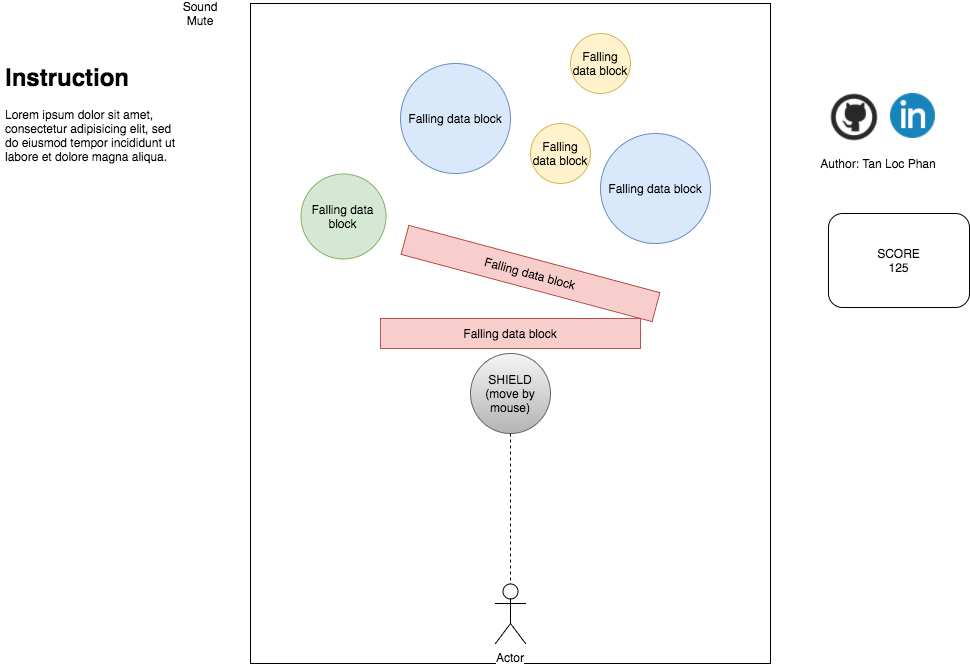

# Data Block

[Live Demo](https://locphan2207.github.io/Data-block/)

## Overview
Data Block is a 2D game built by purely JavaScript and its data-driven library `D3.js`. In Data Block, players will use the mouse to control a shield to protect a character from being hit by _big blocks of data_ falling down from the sky.   
Each data block has a shape such as a circle, a bar. The size of a block is determined by the size of its corresponding data which is bounded to it.

## Functionality & MVP
- [x] Create circles with colors and sizes corresponding to their bounded data.
- [x] Apply basic Physic Laws on all objects (gravity, collision, damping force)
- [x] Make sounds on collisions
- [x] Randomly get data and bound it to a object, and let the object fall from sky
- [x] Score on hitting the falling data blocks   

In addition:
- [X] Add character picture
- [ ] Make rotating objects

## Wireframe
This game has one single screen with the `svg` element created by `D3`. The playing area is in the center of the screen. There are instructions on the left, score board on the right, mute sound button, and links to my personal sites.   

## Architecture and Technologies
This project will be implemented with the following technologies:
* Vanilla JavaScript for overall sctructure and game logic,
* D3.js for creating falling objects and bounding data
* Webpack to bundle many files into one

## Timeline
**Weekend**:
- [x] Thinking of ideas.
- [x] Testing out different projects
- [x] Writing proposal
- [x] Set up npm packages(webpack, d3)   

**Day 1**:
- [x] Create circle objects by D3
- [x] Find a way to bind D3 element with data
- [x] Create game loop

**Day 2**:
- [x] Get gravity working   
- [x] Create character
- [x] Create shield
- [x] Get collision working
- [x] Learn how to move an object with player mouse

**Day 3**:   
- [x] Choose and test API call
- [x] Bind data into object, and test object's size with its data
- [x] Test game overall

**Day 4**:
- [ ] Add score board
- [x] Add sounds
- [x] Add instructions
- [x] Add personal links
- [x] Styling
